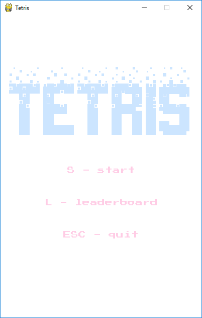
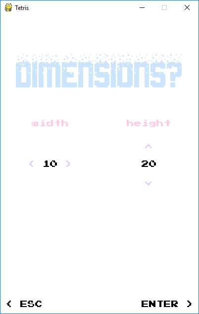
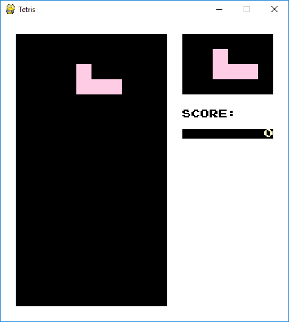
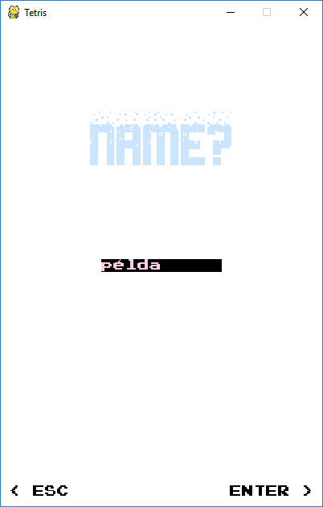
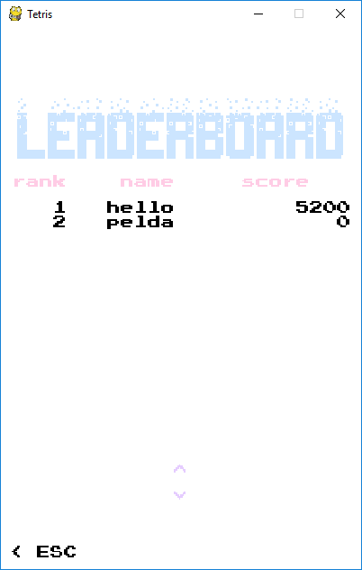

# Tetris - Felhasználói dokumentáció

## Játékleírás

*„A Tetris (oroszul: Тетрис) egy ügyességi és logikai videojáték, melynek első változatát az
orosz Alekszej Pazsitnov tervezte meg és készítette el az Elektronika 60 nevű számítógépre,
míg az Orosz Tudományos Akadémia munkatársaként dolgozott Moszkvában. A játék neve a
görög tetra kifejezés (minden egyes elem négy részből áll) és Pazsitnov kedvenc sportja, a
tenisz összevonásából ered.”* ([forrás](https://hu.wikipedia.org/wiki/Tetris))

A Tetris egyike a legismertebb számítógépes játékoknak – célja, hogy a pályára eső 4 elemből
álló alakzatokat (tetrominokat) a játékos jobbra-ballra mozgatással és forgatással úgy
manipulálja, hogy azok leérve a pálya teljes szélességében sorokat töltsenek ki. Ha ez sikerül,
az adott sor eltűnik, és a játékos pontot szerez. A játékot megnyerni nem, csak elveszteni lehet
– ha a pályára érkező újabb alakzatoknak már nem marad hely.

## A program indítása

A programot kicsomagolás után a menu.py fájl futtatásával lehet elindítani. Ezt a legtöbb
operációs rendszeren egyszerűen a következő parancs kiadásával tehetjük meg:

> python menu.py

A program futtatásának előfeltétele a Python futtatókörnyezet legalább 3.7-es verziója és a
PyGame könyvtár telepítése – utóbbiról további információt annak [honlapján](https://www.pygame.org/wiki/GettingStarted) 
lehet találni.

## A játék kezelése

### Menü

A programba belépve a menüvel találjuk szembe magunkat. Innen
az **S gomb** megnyomásával indítható maga a játék, illetve az **L gomb** megnyomásával megtekinthetők az eddig rögzített
pontszámok. Az **ESC gomb** megnyomásával kiléphetünk a
játékból.

### Pálya méretének beállítása

A játék indítása után a program bekéri a pálya méretét. A **jobb, illetve bal nyíl** segítségével a pálya szélességét,
a **fel illetve lefele nyíl** segítségével a pálya magasságát állíthatjuk. Ezután az **ENTER gomb** megnyomásával
léphetünk be a játéktérbe. Az **ESC gomb** visszavisz a menübe.

### Játéktér

A játéktér három fő részből áll:

* Bal oldalon látható az „akna” (vagy „mátrix”), amely a játék aktuális állását, az egyes elemek helyét mutatja.
* Jobb felül látható a következő várható elem
* Jobb alul az aktuális pontszám

Az **ESC gomb** megnyomásával a játéknak idő előtt véget lehet vetni. A **jobb, illetve bal nyíl** segítségével a
jelenleg mozgó elem jobbra, illetve balra mozgatható. A **felfele nyíl** az elemet 90 fokkal elforgatja, míg a lefele
nyíl gyorsítja az elem lefele mozgását. A játékot a **szóköz gomb** lenyomásával lehet szüneteltetni,
ismételt megnyomására pedig folytatódik a játék. Miután a játék véget ért, a **szóköz gomb**
megnyomásával lehet továbblépni a pontszám rögzítéséhez.

### Pontszám rögzítése

A pontszám rögzítéséhez egy nevet kell megadni a billentyűzettel. Az **ENTER gomb** megnyomása után a pontszám rögzítésre kerül és
az eddigi legjobb pontszámok listájára ugrunk, az **ESC gomb** ehelyett inkább visszatér a menübe.

### Eddig rögzített pontszámok

A pontszámok listáján csökkenő sorrendben láthatók azok a pontszámok, amiket eddig rögzítettünk. A **le, illetve fel nyilakkal**
lehet lapozni, az **ESC gomb** lenyomása után a program visszatér a főmenübe.
